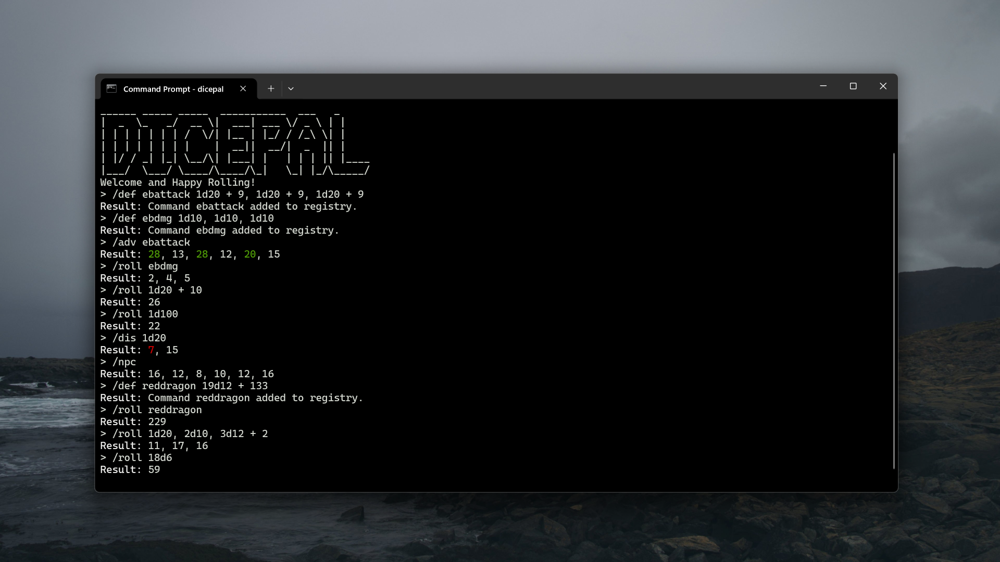

# Dice Pal



## Introduction
Dice Pal is a CLI based Dice Rolling program for rolling RPG dice. It is written in Java.
The program takes an input string and parses it for dice information, and automatically performs dice rolls and sums the results.

For example:

```
/roll 1d20
```

You can roll any number or kind of dice.

```
/roll 2d10
```

and adding Arithmetic symbols (such as plus or minus) will allow you to add together the results of multiple dice, or any modifiers you want to include. Note that for the time being, spaces **must** be included or the command will fail. So

```
/roll 1d10 + 5 + 2d6
```

works, but

```
/roll 1d10+5+2d6
```

does not.
## How To

DicePal comes complete with a handful of commands, and there are plans to add more along the way. The most obvious command is the `/roll` command, but we also have:

| Command  | Explanation                                                                                                                                                             |
| -------- | ----------------------------------------------------------------------------------------------------------------------------------------------------------------------- |
| `/roll`  | Standard dice roll.                                                                                                                                                     |
| `/adv`   | Roll all dice with advantage. (NOTE! Multiple dice (`2d20`, will simply take the highest result of both `d20`'s rolled and summed. Current limitation of the program.)) |
| `/dis`   | Roll with Disadvantage.                                                                                                                                                 |
| `/npc`   | Roll a standard DND statblock using the `4d6` drop lowest method.                                                                                                       |
| `/def`   | Defines a custom roll for easy rolling later. Uses `<Name>` `<Roll>` format. (See example below.)                                                                       |
| `/clear` | Clears all registered custom rolls. Cannot be undone.                                                                                                                   |
| `/help`  | Prints a list of all commands and what they do.                                                                                                                         |
| /`exit`  | Closes the program.                                                                                                                                                     |
For rolling multiple sets of dice but separating the results, (such as for different damage types) you can separate the rolls with a comma. EG:

```
/roll 1d20 + 5, 1d12 + 7, 1d4 
```

This will return something like:

```
Result: 17, 13, 2
```

#### Defining custom rolls

To define a custom roll, give a name for the roll and then input the roll information. EG:

```
/def dragon 19d12 + 133
```

Note that all names are formatted to lowercase automatically. So if you put `Dragon`, the command will be registered as `dragon`. Reused names overwrite previous definitions.

## Installation
Currently, the program is only tested on Windows.
This program requires an installation of the Java Runtime Environment.

To install the program, download the Jar file from the releases page. Pick a folder to store the file. In order to run the program from the command line you'll need to add the projects folder to the path, and create a batch file that executes the jar. I'm not really qualified to explain this, but there shoul dbe useful resources on google that can help.

## Roadmap

I don't have a set roadmap for this. Mostly just working on it in my spare time. That said, I do have some planned features for future releases.

There are plans to add different rolling methods to the NPC generator, either to account for different systems, or simply different stat generation methods (`eg, 1d20`). Could possibly introduce a "favored stat" where you write `/npc dex` and roll with advantage specifically on the dex stat. We'll see what I get around to.

At some point in the future I'd like to remake this program either in `C` or `Rust`.
